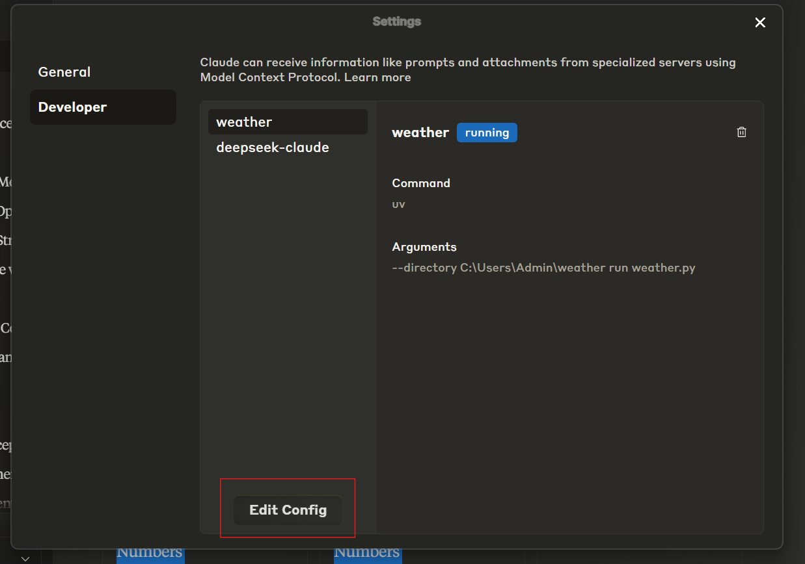
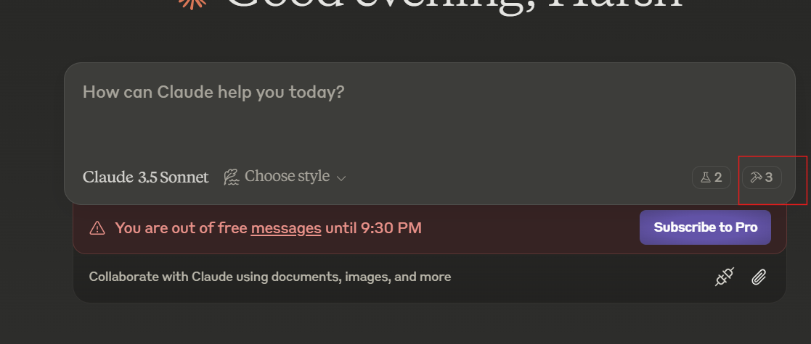
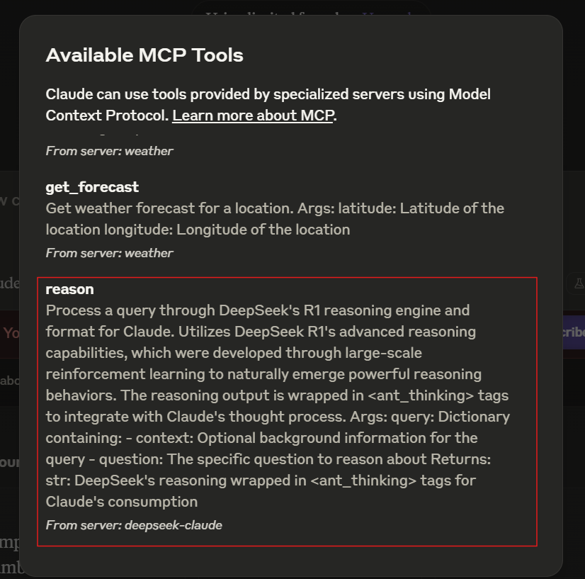

# DeepSeek-Claude MCP Server
[](https://smithery.ai/server/@HarshJ23/deepseek-claude-MCP-server)

**Enhance Claude's reasoning capabilities** with the integration of DeepSeek R1's advanced reasoning engine. This server enables Claude to tackle complex reasoning tasks by leveraging the reasoning capabilites of deepseek r1 model.

<a href="https://glama.ai/mcp/servers/w3q7v1srsw"></a>

---

## 🚀 Features

### **Advanced Reasoning Capabilities**
- Seamlessly integrates DeepSeek R1's reasoning with Claude.
- Supports intricate multi-step reasoning tasks.
- Designed for precision and efficiency in generating thoughtful responses.


---

## Complete Setup guide

### Installing via Smithery

To install DeepSeek-Claude for Claude Desktop automatically via [Smithery](https://smithery.ai/server/@HarshJ23/deepseek-claude-MCP-server):

```bash
npx -y @smithery/cli install @HarshJ23/deepseek-claude-MCP-server --client claude
```

### Prerequisites
- Python 3.12 or higher
- `uv` package manager
- DeepSeek API key (Sign up at [DeepSeek Platform](https://platform.deepseek.com))


1. **Clone the Repository**
   ```bash
   git clone https://github.com/harshj23/deepseek-claude-MCP-server.git
   cd deepseek-claude-MCP-server
   ```

2. **Ensure UV is Set Up**
   - **Windows**: Run the following in PowerShell:
     ```powershell
     powershell -ExecutionPolicy ByPass -c "irm https://astral.sh/uv/install.ps1 | iex"
     ```
   - **Mac**: Run the following:
     ```bash
     curl -LsSf https://astral.sh/uv/install.sh | sh
     ```

3. **Create Virtual Environment**
   ```bash
   uv venv
   source .venv/bin/activate
   ```

4. **Install Dependencies**
   ```bash
   uv add "mcp[cli]" httpx
   ```

5. **Set Up API Key**
   ```bash
   Obtain your api key from here : https://platform.deepseek.com/api_keys
   ```

6. **Configure MCP Server**
   Edit the `claude_desktop_config.json` file to include the following configuration:
   

   ```json
   {
       "mcpServers": {
           "deepseek-claude": {
               "command": "uv",
               "args": [
                   "--directory",
                   "C:\\ABSOLUTE\\PATH\\TO\\PARENT\\FOLDER\\deepseek-claude",
                   "run",
                   "server.py"
               ]
           }
       }
   }
   ```

7. **Run the Server**
   ```bash
   uv run server.py
   ```

8. **Test Setup**
   - ##### Restart Claude Desktop.
   - Verify the tools icon is visible in the interface.
   


   - If the server isn’t visible, consult the [troubleshooting guide](https://modelcontextprotocol.io/quickstart/server#troubleshooting).

---

## 🛠 Usage

### Starting the Server
The server automatically starts when used with Claude Desktop. Ensure Claude Desktop is configured to detect the MCP server.

### Example Workflow
1. Claude receives a query requiring advanced reasoning.
2. The query is forwarded to DeepSeek R1 for processing.
3. DeepSeek R1 returns structured reasoning wrapped in `<ant_thinking>` tags.
4. Claude integrates the reasoning into its final response.

---


## 📄 License

This project is licensed under the MIT License. See the [LICENSE](LICENSE) file for details.

---
